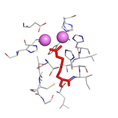

PRELYSCAR-WEB
=========

___The online version of PreLysCar tool___

Available at [http://tanto.bioe.uic.edu/prelyscar/](http://tanto.bioe.uic.edu/prelyscar/)

# Description

The **Pre**dictor of **Lys**ine **Car**boxylation is a tool developed to predict the carboxylation of lysine residues using as input the 3D-structure of proteins in `PDB format`.

# Deployment on `tanto`

### Clone for the first time
`git clone https://github.com/biodavidjm/prelyscar-web`

### Updates
`git pull`

# Testing locally on a Mac

* MAMP for the Apache & PHP server

